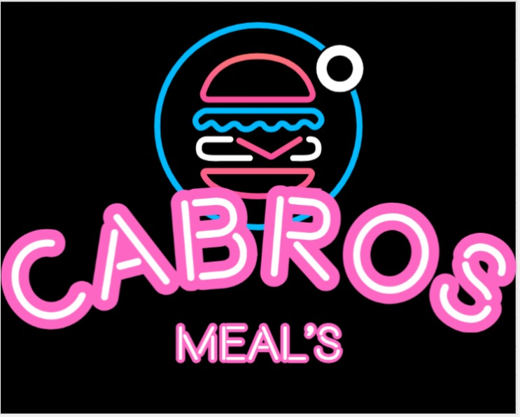
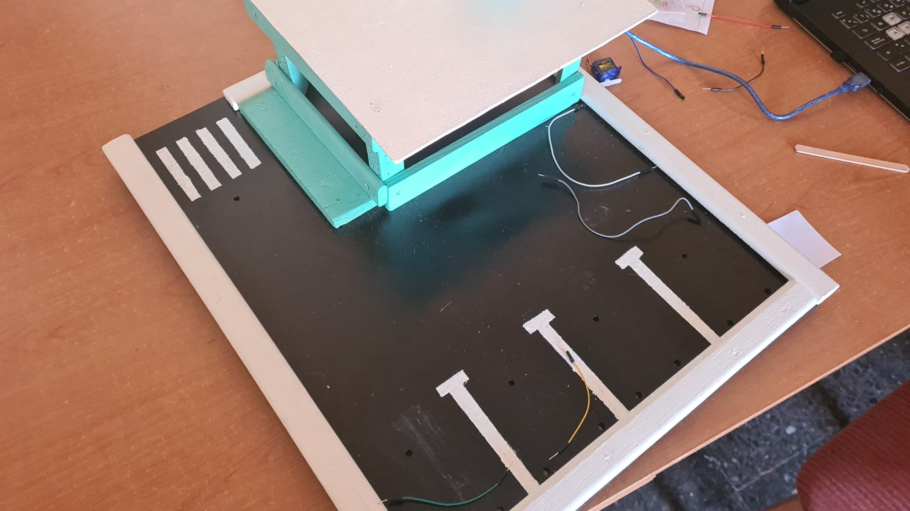
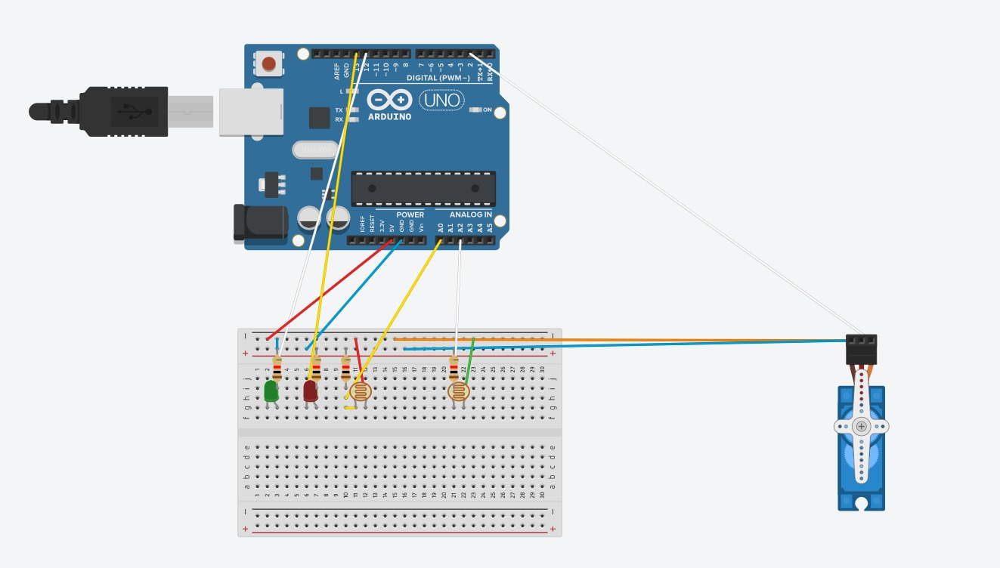
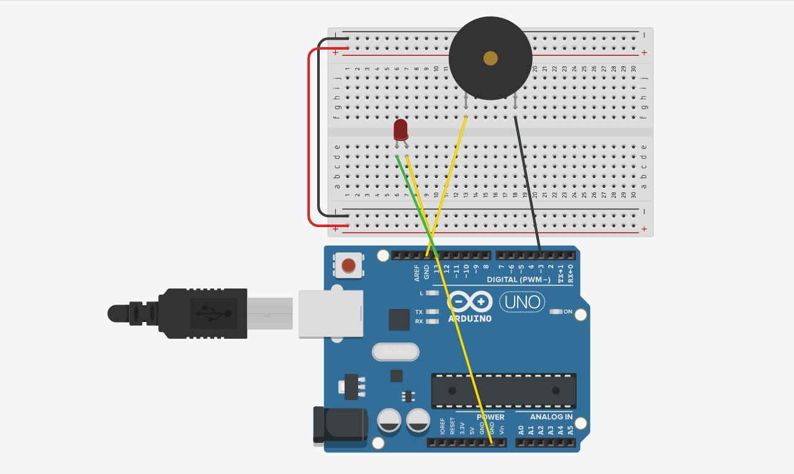
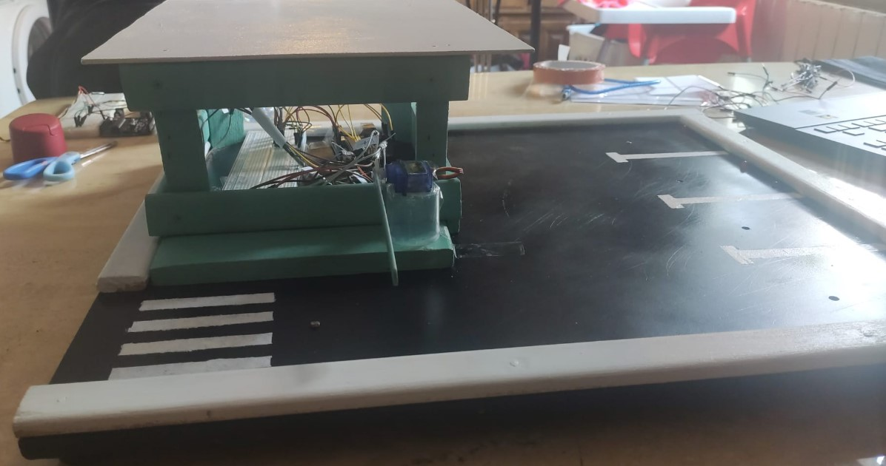

# Smart-Parking-IOT

***¿Que haremos?***

En este Proyecto iot, haremos un parking inteligente el cual esta ambientado en un restaurante de los 50 llamado cabros meal,
el nombre del proyecto sera **Smart Parking.**

**Funcionamiento.**

Nuestro proyecto tendra 3 grandes acciones a realizar:

**1)** Un servomotor que simulara la barrera de paso del parking, la cual mediante un LDR detectara al coche
haciendo que esta suba.

**2)** Cada puesto de estacionamiento tendra una led verde y una led roja, las cuales tambien mediante un LDR
detectaran si esta o no ocupado el puesto, iluminando la verde en caso de estar libre el puesto, o rojo en caso
de este estar ocupado.

**3)** Tendra una corneta que reproducira un par de canciones, la cual tendra una led neon darle ambientacion al restaurante,
simulando las mismas usadas en esa epoca, esta se apagara y prendera al ritmo de la musica.

***¿Donde lo haremos?***

Todo el trabajo IOT lo aplicaremos en una maqueta la cual simulara como dijimos antes, el aspecto que tenian algunos
restaurantes en los años 50.

***Esquemas IOT***

Nuestro proyecto esta dividido en dos bloques para su funcionamiento, estos son:

**Bloque 1.**

Este sera el encargado de hacer funcionar tanto al servomotor como a los sensores de los puestos de estacionamiento
mediante los LDR, este se veria asi:

**Bloque 2.**

Este nos servira para hacer funcionar la corneta para la musica y la led que se apagara y encendera al ritmo de esta,
viendose asi la estructura:

***Elementos a utilizar***

**Para el bloque 1 necesitaremos:**

- 11 cables.
- 4 resistencias de 10k.
- 2 LED's.
- 2 LDR's.
- 1 servomotor
- 1 Protoboard
- 1 Arduino.

**Para el bloque 2 necesitaremos:**

- 1 Buzzer(Corneta).
- 6 cables.
- 1 LED
- 1 Protoboard
- 1 Arduino

***Resultado final de la estrutura.***

